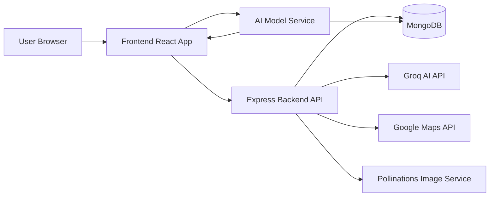

# Architecture Diagram

## Components

- Frontend: user interface for detection, reuse guidance, reports, and dashboards
- Backend: authentication, persistence, analytics, and API orchestration
- AI model service: YOLO-based detection and model inference support
- MongoDB: stores users, detections, reports, and dashboard data
- External APIs: AI text generation, maps, and image generation
